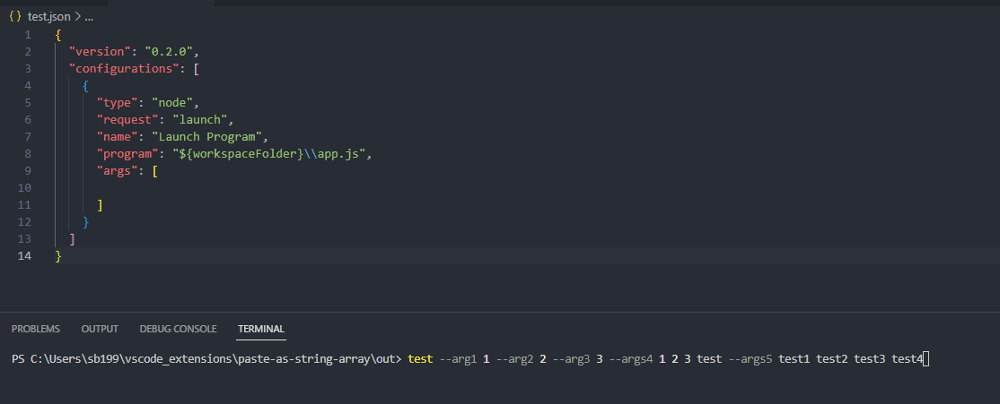

# paste-as-string-array 


Tired of having to convert command line arguments to an array of strings for use in `launch.json` in VSCode? You're not alone. This extension solves this issue by automatically converting arguments to fit VSCode expectations.

## Features

### Paste As String Array

Simply execute the `Paste as String Array` command in Ctrl+shift+P or use the following shortcuts

* Windows: Ctrl+Alt+V
* Linux: Ctrl+Alt+V
* MacOS: Cmd+Shift+V

It will convert an example cmdline from this:

```
--arg1 1 --arg2 2 --arg3 3 --args4 1 2 3 test --args5 test1 test2 test3 test4
```

To this
```
"--arg1","1","--arg2","2","--arg3","3","--args4","1","2","3","test","--args5","test1","test2","test3","test4"
```


