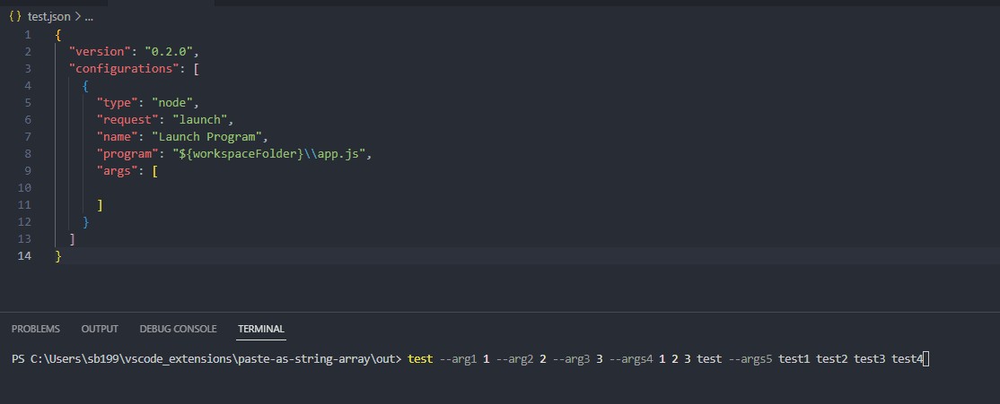

# paste-as-string-array 


Tired of having to convert command line arguments to an array of strings for use in `launch.json` in VSCode? You're not alone. This extension solves this issue by automatically converting arguments to fit VSCode expectations.

## Features

### Paste As String Array

Simply execute the `Paste as String Array` command in Ctrl+shift+P or use the following shortcuts

* Windows: Ctrl+Alt+V
* Linux: Ctrl+Alt+V
* MacOS: Cmd+Shift+V

It will convert an example cmdline from this:

```
--arg1 1 --arg2 2 --arg3 3 --args4 1 2 3 test --args5 test1 test2 test3 test4
```

To this
```
"--arg1","1","--arg2","2","--arg3","3","--args4","1","2","3","test","--args5","test1","test2","test3","test4"
```




## Right-click and Editor Title

You can now access `Paste as String Array` from the editor's context (right-click) menu and from the editor title menu. Use the right-click menu when you want to paste directly into the editor without opening the command palette.

## Icons and Marketplace Assets

This repository includes the extension icon in several sizes to make publishing to the VS Code Marketplace easier.

- `images/icon.png` — original downloaded icon (used as the package `icon`).
- `images/icon-128.png` — 128×128 (recommended for Marketplace display).
- `images/icon-256.png` — 256×256 (higher-resolution asset).

When packaging the extension with `vsce` the `icon` field in `package.json` points to `images/icon.png` and will be included in the `.vsix`:

```
"icon": "images/icon.png"
```

Marketplace tips:
- When publishing on the Marketplace you can upload additional images (128×128 or 256×256) in the publisher portal — include `icon-128.png`/`icon-256.png` there for best results.
- Keep the images in `images/` so contributors see the actual assets and you can easily regenerate or replace them.

If you want, I can also:
- Repackage a new `.vsix` including these icons.
- Add a small `publish` section to `README.md` with exact steps for `vsce package` and `vsce publish`.

## Publishing

To package the extension locally and create a `.vsix` (includes the `icon` referenced in `package.json`):

```bash
# create the package (outputs e.g. advanced-paste-as-string-array-1.0.0.vsix)
npx vsce package
# or using yarn
yarn dlx vsce package
```

To publish the extension to the VS Code Marketplace you need a publisher and a Personal Access Token.

Basic publish steps:

1. Install `vsce` (optional if using `npx`/`yarn dlx`):

```bash
npm install -g vsce
```

2. Create a Personal Access Token in your Azure DevOps account (PAT) and set it into an environment variable:

```bash
export VSCE_PAT="<your-personal-access-token>"
```

3. Publish (example — publish a patch):

```bash
npx vsce publish --pat $VSCE_PAT --packagePath ./advanced-paste-as-string-array-1.0.0.vsix
# or increment and publish a patch version directly:
npx vsce publish patch --pat $VSCE_PAT
```

See the `vsce` docs for more publish options and authentication details: https://code.visualstudio.com/api/working-with-extensions/publishing-extension